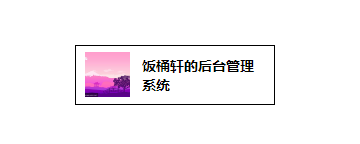

### Logo

示例：
| |效果|代码示例|
|-|-|-|
|type === 'fill'  | |`<Logo url="图片地址" title="logo名字" />`|
|type === 'nofill'| |`<Logo url="图片地址" title="logo名字" type="nofill" />`|

> 当 `type === 'fill'` 时，`title` 就会隐藏，图片会覆盖满整个容器

参数
|参数名|函数|是否必填|默认值|值选项|值类型|
|-|-|-|-|-|-|
|url|logo 的图片地址|true|-|-|Boolean|
|title|要显示的文字|false|-|-|String|
|type|是否要填满整个容器|false|fill|'fill'、'nofill'|String|

